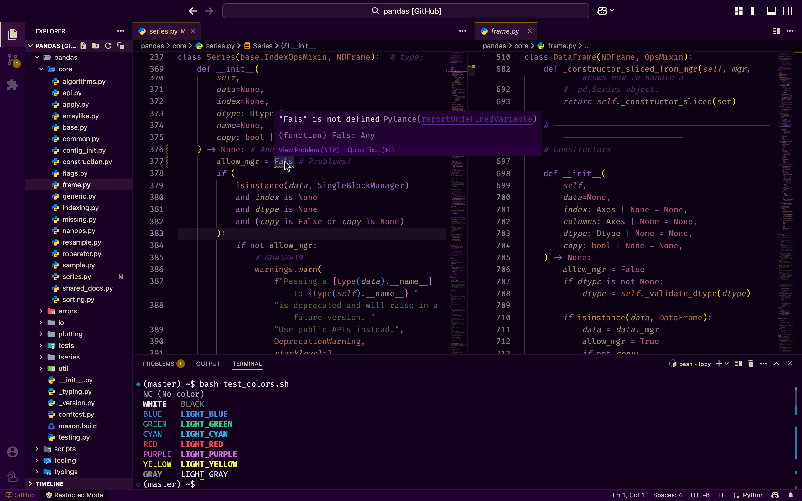

# 🌙 Purple Owl - VSCode Theme

**Purple Owl** is a sleek yet soft dark theme for the best editor ever, designed to be easy on the eyes and delightful to use. With deep purples and a focus on syntax clarity, Purple Owl makes long coding sessions more comfortable and visually appealing.

Made with 💜 by [jumpingtj](https://github.com/jumpingtj)

## ✨ Features

- Rich, contrast-balanced dark background
- Soft purple hues with carefully chosen highlight colors
- Designed for readability and long coding sessions
- Supports all popular programming languages and file types
- Custom styling for markdown, JSON, HTML, CSS, JS, Python, and more

## 🛠 Installation

1. Open **Extensions** sidebar in VSCode: `View → Extensions`
2. Search for **Purple Owl**
3. Click **Install**
4. Open Command Palette: `Ctrl+Shift+P` or `Cmd+Shift+P` on Mac
5. Select `Preferences: Color Theme` and choose **Purple Owl**

## 🧙‍♀️ Why "Purple Owl"?

Owls are wise, nocturnal creatures—just like you when you're coding at 2AM. Purple Owl is for developers who want a bit of mystery and magic in their IDE.

## 🙌 Contributing

Found an issue or want to suggest improvements?
PRs are welcome [on GitHub](https://github.com/jumpingtj/purple-owl), but the theme uses similar colors for everything (e.g. all bgs are the same hue) so do keep that if you want to change anything.

It's under [MIT](https://github.com/jumpingtj/purple-owl/blob/master/LICENSE) - so feel free to use it! I'd love to see you experiment yourself (but do read MIT first - it's only two paragraphs).

The screenshot used above is of [Pandas](https://github.com/pandas-dev/pandas); LICENSE included

Thanks,
jumpingtj!
